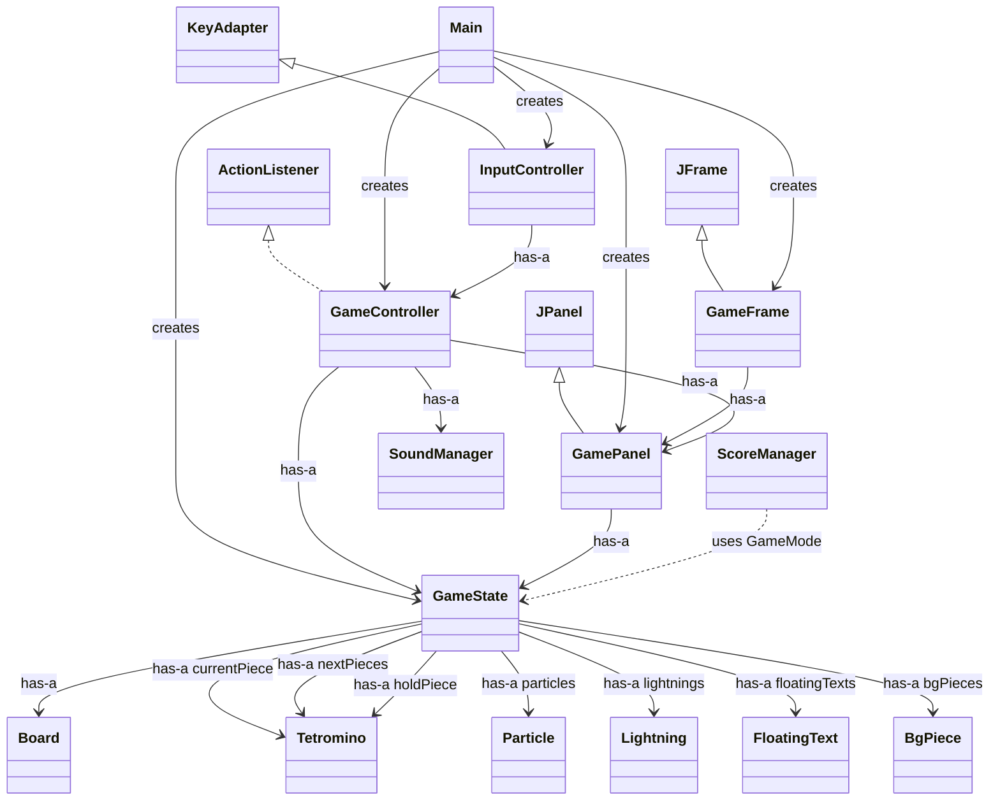
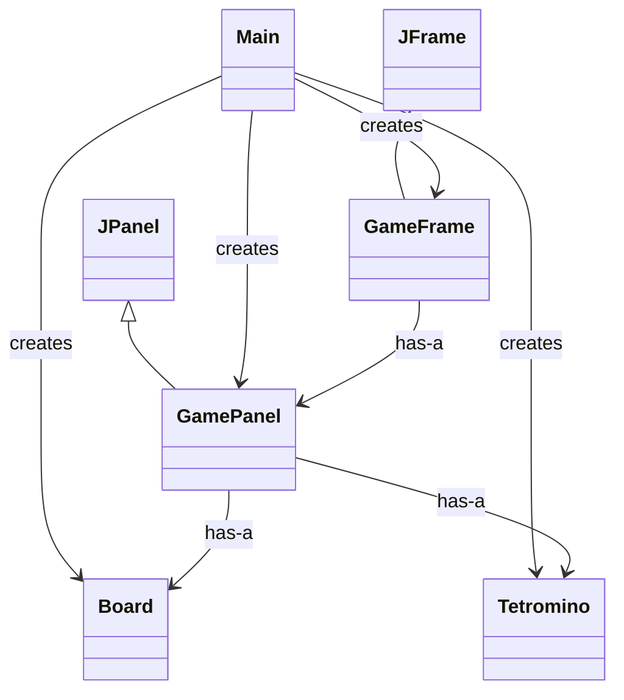
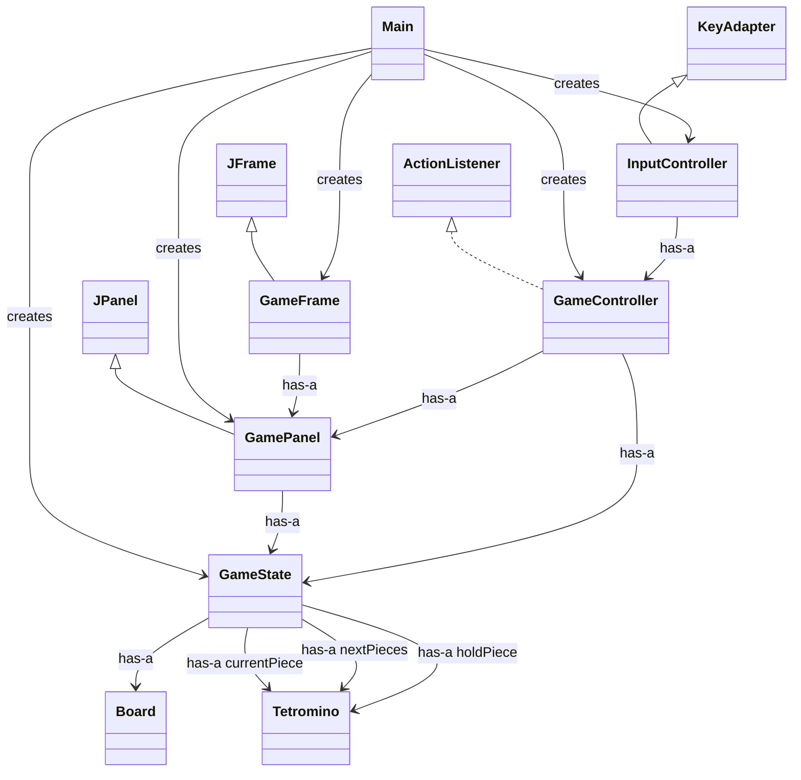
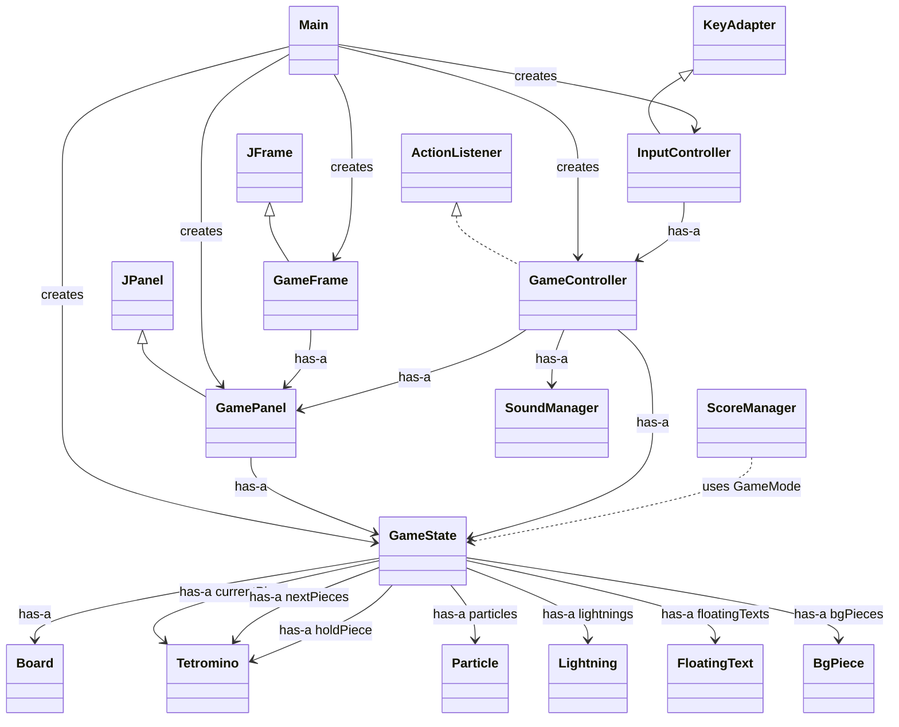

# Java-Tetris 架構 UML 教學文件

這份文件的用途，是從 UML 的角度快速看懂整個 Java-Tetris 專案。
如果想先建立整體閱讀方向，建議先看 [PROJECT_OVERVIEW.md](C:/Users/sheng/github-repo/java-vibe-william/Java-Tetris/PROJECT_OVERVIEW.md:1)。
如果 [progression.md](C:/Users/sheng/github-repo/java-vibe-william/Java-Tetris/progression.md:1) 強調的是「功能如何一階段一階段演化出來」，那這份文件強調的就是「目前專案中的主要類別，彼此如何連接」。

---

## 一、文件定位

- 幫助學生快速辨認專案中的主要類別。
- 用 `has-a` 與 `is-a` 兩種關係理解物件導向設計。
- 從「骨架」、「可玩核心」、「完整系統」三個層次觀看同一個專案。
- 讓學生在閱讀原始碼前，先建立整體結構印象。

---

## 二、UML 閱讀方式

- `is-a`：表示繼承或實作關係。
  - 例如 `GameFrame is-a JFrame`
  - 例如 `InputController is-a KeyAdapter`
- `has-a`：表示某個類別擁有、參考或依賴另一個類別。
  - 例如 `GameState has-a Board`
  - 例如 `GameController has-a SoundManager`

在這個專案裡，最重要的觀察不是每個方法細節，而是：

- 哪些類別負責保存資料
- 哪些類別負責畫面
- 哪些類別負責規則與控制
- 哪些類別負責系統服務或使用者體驗

---

## 三、整體架構總覽

這張圖先把整個專案拆成四個區塊：

- 啟動入口
- 視窗與畫面
- 遊戲狀態與規則
- 系統服務與特效

### UML 類別關係圖

### 整體架構重點

- `Main` 是啟動入口，負責把整個 MVC 架構組起來。
- `GameState` 是資料中心，保存棋盤、方塊、模式、分數與特效狀態。
- `GameController` 是規則中心，負責推進遊戲流程。
- `GamePanel` 是視覺輸出中心，負責把目前狀態畫出來。
- `SoundManager` 與 `ScoreManager` 是系統服務，不直接參與棋盤碰撞邏輯。

---

## 四、階段一：基本類別與棋盤骨架

這個階段適合課程一開始使用。目標不是完整遊戲，而是先理解最基本的結構。

### UML 類別關係圖

### 本階段觀察重點

- `Tetromino` 代表方塊資料。
- `Board` 代表棋盤資料。
- `GamePanel` 代表畫面輸出。
- `GameFrame` 只是承載畫面的視窗。
- `Main` 只負責組裝，不負責遊戲規則。

### 教學提問

- 為什麼 `Board` 不應該負責處理視窗？
- 為什麼 `Tetromino` 不應該直接監聽鍵盤？
- 如果只想改變畫面外觀，應該優先修改哪個類別？

---

## 五、階段二：移動、碰撞、消橫列與計分

這個階段讓遊戲真正「玩得起來」。
重點是加入狀態管理、輸入控制與遊戲規則控制。

### UML 類別關係圖

### 本階段觀察重點

- `InputController` 把鍵盤事件轉成遊戲操作。
- `GameController` 決定方塊能不能移動、旋轉、落下與固定。
- `GameState` 保存所有目前遊戲中的資料。
- `Board` 提供碰撞判定、落地寫入與消行基礎功能。

### 教學提問

- `InputController` 不直接改棋盤，而是交給 `GameController`。
- `GamePanel` 不決定規則，只根據 `GameState` 顯示結果。
- `GameState` 的存在，讓資料集中，不會散在各個畫面與控制類別中。

---

## 六、階段三：系統優化與完整體驗

這個階段對應目前專案比較完整的樣子。
除了核心玩法，也包含音效、模式、特效與資料持久化。

### UML 類別關係圖

### 本階段觀察重點

- `SoundManager` 讓遊戲具有聽覺回饋。
- `ScoreManager` 讓高分可以保存，不只存在記憶體。
- `Particle`、`Lightning`、`FloatingText` 讓遊戲事件被視覺化。
- `BgPiece` 讓選單與背景不再只是靜態畫面。

### 教學提問

- 核心玩法類別與周邊服務類別要分開。
- 視覺特效不是遊戲規則本身，但能提升使用者理解與回饋感。
- 一個完整系統通常會有「核心邏輯」、「畫面」、「輸入」、「服務」四種不同角色。

---

## 七、主要類別職責對照

### 啟動與畫面

- `Main`：建立並串接主要物件，啟動遊戲。
- `GameFrame`：建立 Swing 視窗。
- `GamePanel`：根據 `GameState` 把遊戲畫面繪製出來。

### 狀態與規則

- `GameState`：保存棋盤、方塊、分數、模式、特效與選單狀態。
- `Board`：保存格子資料，提供碰撞與消行相關操作。
- `Tetromino`：描述方塊形狀與旋轉資料。
- `GameController`：控制遊戲流程、規則判定與狀態更新。
- `InputController`：處理鍵盤輸入並轉交給控制器。

### 系統服務與體驗

- `SoundManager`：播放背景音樂與音效。
- `ScoreManager`：讀寫高分資料。
- `Particle`、`Lightning`、`FloatingText`：特效資料物件。
- `BgPiece`：背景裝飾資料物件。

---

## 八、使用案例總覽

**主要角色**
- 玩家

**主要用例**
- 啟動遊戲
- 在主選單中選擇模式
- 控制方塊左右移動、旋轉、下落、暫停與保留
- 消除橫列並累積分數
- 觸發音效、背景音樂與畫面特效
- 遊戲結束後保存高分

---

## 九、情境流程總覽

1. 玩家執行 `Main` 啟動程式。
2. 系統建立 `GameState`、`GamePanel`、`GameController`、`InputController` 與 `GameFrame`。
3. 玩家在選單中選擇模式後，`GameController` 初始化新的一局。
4. 玩家透過鍵盤控制方塊，`InputController` 將操作轉交給 `GameController`。
5. `GameController` 使用 `Board` 與 `GameState` 進行碰撞判定、移動、落地、消行與計分。
6. `GamePanel` 依照最新狀態重新繪製棋盤、預覽區、特效與覆蓋畫面。
7. `SoundManager` 播放對應的 BGM 與 SFX。
8. 遊戲結束後，`ScoreManager` 視情況更新高分檔案。

---

## 十、教學使用建議

- 先用這份文件建立整體結構感。
- 再搭配 [progression.md](C:/Users/sheng/github-repo/java-vibe-william/Java-Tetris/progression.md:1) 說明三階段演化。
- 最後帶學生回到 `src/tetris/` 的原始碼，逐類別對照 UML。

如果學生能同時回答下面三個問題，通常就代表他已經真的看懂架構：

1. 哪些類別在保存資料？
2. 哪些類別在控制規則？
3. 哪些類別是在擴充體驗，而不是核心玩法本身？
