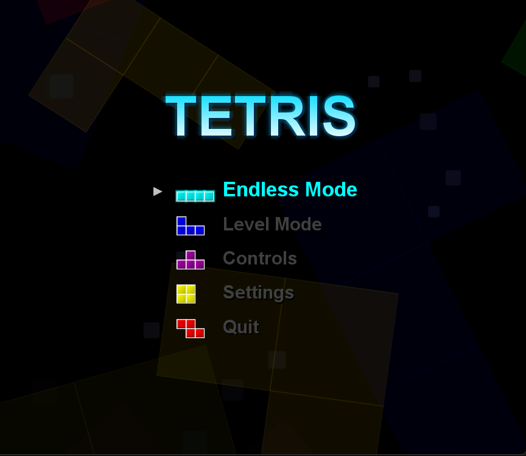
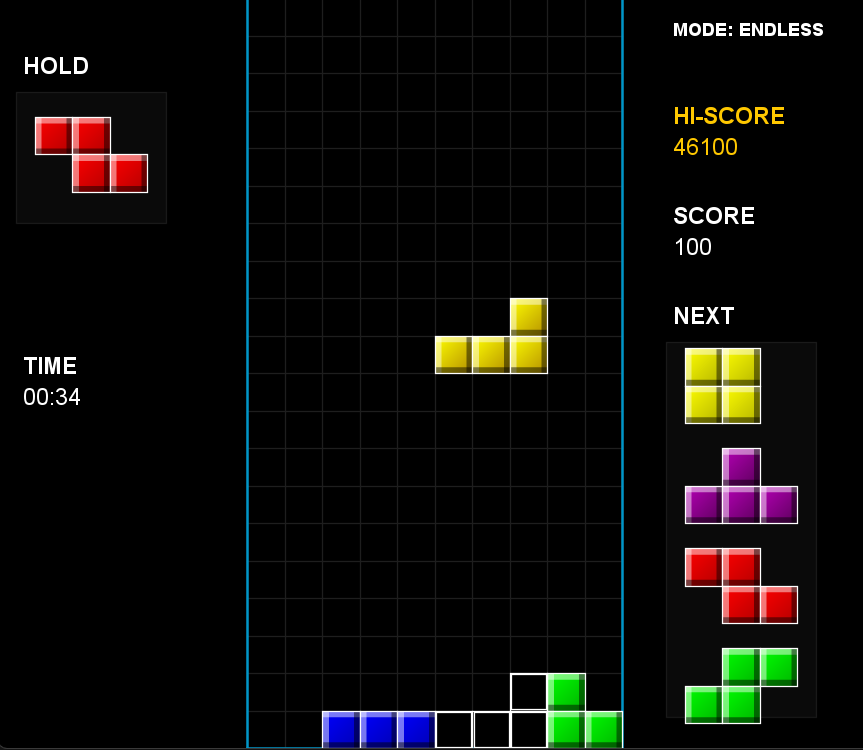
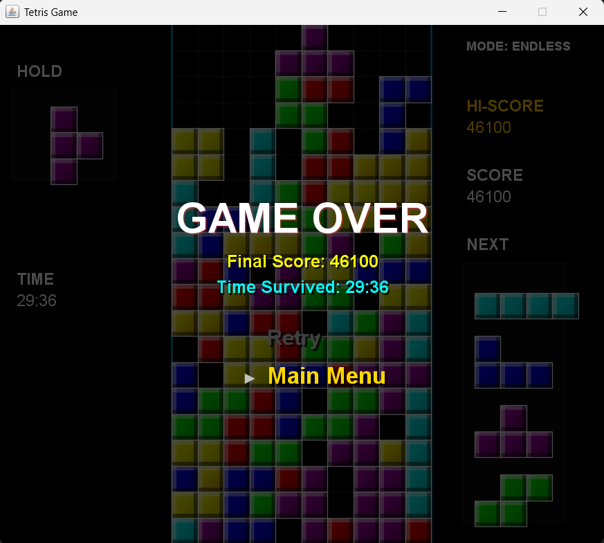

# Tetris: Java Edition

A Tetris clone developed in Java using standard AWT and Swing libraries. The project implements standard modern Tetris mechanics including the Super Rotation System (SRS) and features a custom rendering engine for block aesthetics and particle effects.





## Features

### Gameplay Mechanics
* **Super Rotation System (SRS)**: Implements standard wall kick data for block rotation near boundaries.
* **Advanced Scoring**: Includes rule sets for T-Spin detection (3-corner rule) and Combo chaining.
* **Modern Controls**: Supports Soft Drop, Hard Drop, and Piece Hold functionality.
* **Ghost Piece**: Displays an indicator at the bottom of the matrix where the piece will land.
* **Game Modes**: Provides Endless Mode and Level Mode (increasing gravity speed).

### Graphics & Interface
* **Custom 3D Rendering**: Uses `Graphics2D` and `GradientPaint` to apply bevel lighting and shadow effects to blocks natively.
* **Particle Effects**: Features physics-based particle spurts on Hard Drop and visual lightning animations on line clears.
* **UI Layout**: Standard three-column layout (Hold, Matrix, Next/Score) with dynamic background animations.

### Audio System
* **Asynchronous SoundManager**: Handles sound effects (SFX) and background music (BGM) in separate threads to prevent blocking the game loop.
* **Format Conversion**: Automatically downsamples unsupported 24-bit/32-bit audio files to 16-bit PCM for compatibility with the Java `Clip` API.
* **State synchronization**: BGM changes seamlessly based on game state (Menu, Playing, Game Over).

### Architecture
* **MVC Pattern**: Separates `GameState` (Model), `GamePanel` (View), and `GameController`/`InputController` (Controller).
* **Game Loop**: A dedicated thread updates the logic and triggers repaints consistently.

---

## Installation & Usage

### Prerequisites
* Java Runtime Environment (JRE) 8 or higher.

### Running the Game
1. Clone the repository or download the latest release block.
2. Ensure that `Tetris.jar` and the `sounds/` directory are located in the **same directory**.
3. Open a terminal or command prompt, navigate to the directory, and run:
   ```bash
   java -jar Tetris.jar
   ```

### Controls
* **Arrow Left / Right**: Move piece
* **Arrow Up / X**: Rotate Clockwise
* **Z**: Rotate Counter-Clockwise
* **Arrow Down**: Soft Drop
* **Space**: Hard Drop
* **C**: Hold Piece
* **Escape**: Pause / Resume Game
* **Enter**: Confirm Selection (Main Menu)