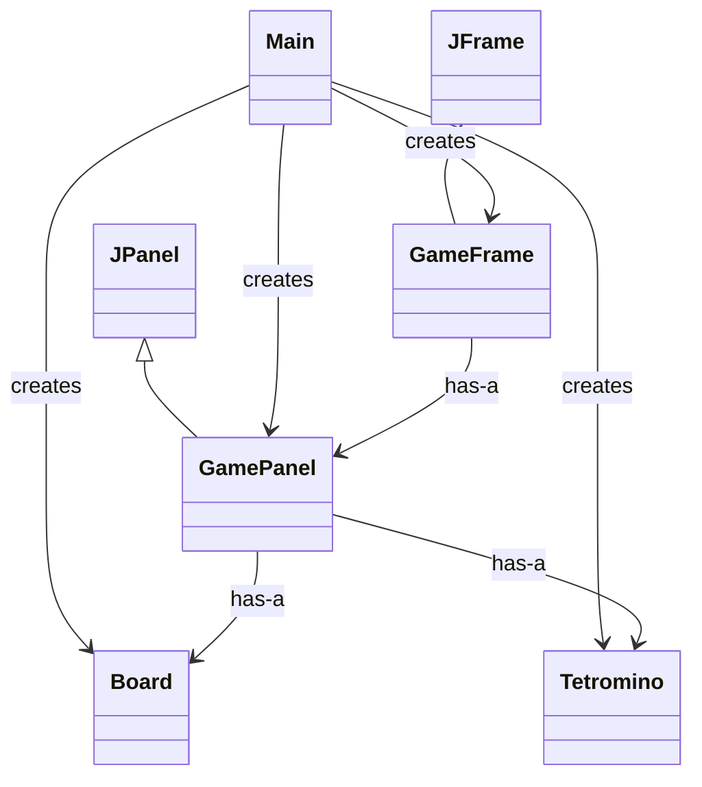
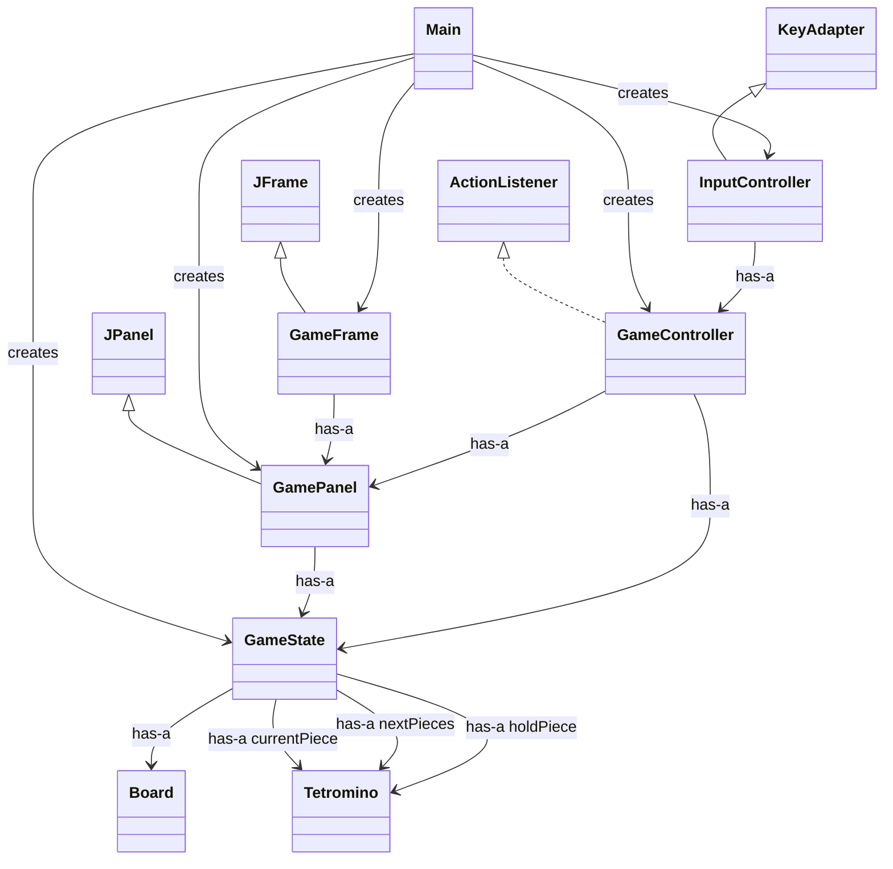
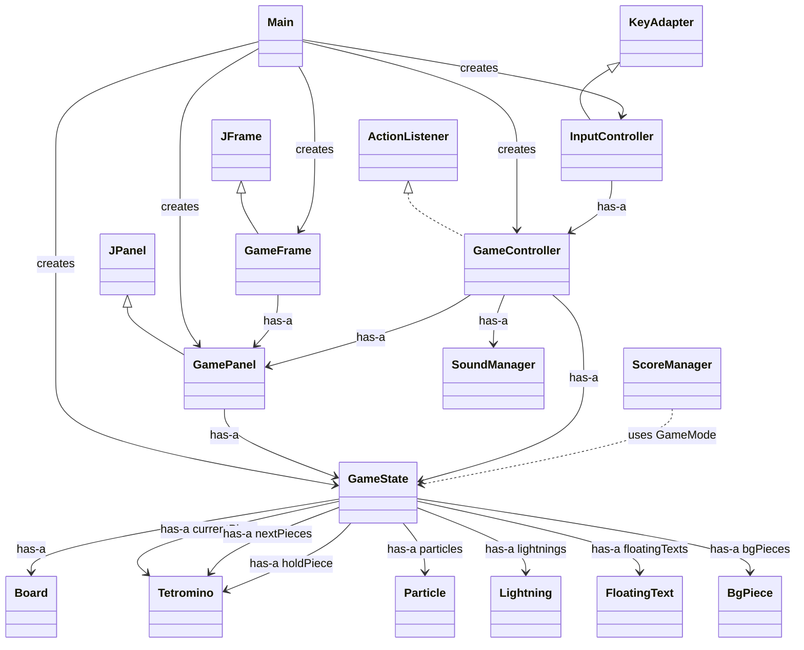

# Java-Tetris 演化式教學文件

這份文件不是在描述「現在這個專案已經有多少功能」，而是要幫助學生理解：
同一個 Tetris 專案，可以如何從簡單版本一路演化成完整系統。

如果想先建立閱讀地圖，建議先看 [PROJECT_OVERVIEW.md](C:/Users/sheng/github-repo/java-vibe-william/Java-Tetris/PROJECT_OVERVIEW.md:1)。
如果想從類別關係與整體架構的角度閱讀，建議再搭配 [OverviewUML.md](C:/Users/sheng/github-repo/java-vibe-william/Java-Tetris/OverviewUML.md:1) 一起使用。

## 一、文件定位

這份文件關心的是「功能如何逐步演化」。
閱讀時建議把注意力放在每一個階段新增了哪些類別、哪些責任，以及為什麼要在那個時間點加入這些設計。

教學重點放在三個改良階段：

1. 先建立 Tetris 的基本類別與畫面骨架。
2. 再加入遊戲規則，讓方塊能移動、碰撞、消行與計分。
3. 最後擴充成較完整的系統，加入音效、模式、特效與整體體驗優化。

每個階段都會搭配：

- 教學目標
- 主要類別與責任
- UML `has-a` / `is-a` 關係圖
- 使用案例
- 情境流程

這樣學生可以明白，複雜功能並不是一次完成，而是一層一層加上去的。

---

## 二、三階段教學總覽

### 階段一：基本類別與棋盤骨架
- 先讓學生認識「方塊是什麼」、「棋盤是什麼」、「畫面怎麼顯示」。
- 重點是資料結構與基本物件分工，不急著一次做完整玩法。

### 階段二：移動、碰撞、消橫列與計分
- 讓方塊能移動、旋轉、下落、碰撞。
- 完成消橫列與分數累加，建立一個真正可玩的 Tetris 核心。

### 階段三：系統優化與完整體驗
- 把單純能玩的遊戲，提升成完整作品。
- 加入模式、選單、音效、背景音樂、特效、暫停、排行榜與其他系統性優化。

---

## 三、階段一：基本類別與棋盤骨架

### 教學目標

- 理解 Tetris 最基本的物件模型。
- 知道「方塊」與「棋盤」應該分成不同類別。
- 建立最小可視版本，能把棋盤與方塊畫到畫面上。
- 讓學生先習慣 `Model` 與 `View` 的分工。

### 本階段重點內容

- `Tetromino`：描述一個方塊的形狀與旋轉資料。
- `Board`：保存棋盤格子內容。
- `GamePanel`：把棋盤與方塊畫出來。
- `GameFrame`：建立視窗。
- `Main`：啟動程式並把元件組起來。

### 核心教學觀念

- `Tetromino` 不負責畫畫，它只負責描述「形狀」。
- `Board` 不負責按鍵控制，它只負責描述「棋盤資料」。
- `GamePanel` 不負責決定遊戲規則，它只負責「把目前資料畫出來」。
- `Main` 的責任是把物件串起來，而不是塞進所有遊戲邏輯。

### UML 類別關係圖

### `has-a` / `is-a` 重點

- `GameFrame is-a JFrame`
- `GamePanel is-a JPanel`
- `GameFrame has-a GamePanel`
- `GamePanel has-a Board`
- `GamePanel has-a Tetromino`

### 使用案例

**主要角色**
- 學生 / 玩家

**主要需求**
- 啟動程式
- 看到棋盤畫面
- 看到一個方塊顯示在棋盤中
- 理解方塊與棋盤資料是分開管理的

### 情境流程

1. 使用者執行 `Main`。
2. `Main` 建立 `Board` 與一個 `Tetromino`。
3. `Main` 建立 `GamePanel`，把棋盤與方塊交給它顯示。
4. `Main` 建立 `GameFrame`，並將 `GamePanel` 放入視窗。
5. 畫面成功顯示，學生可以觀察棋盤與方塊的資料結構。

### 本階段學習重點

- 物件導向不是先追求功能很多，而是先把責任切清楚。
- 有了 `Tetromino` 與 `Board`，後面才能自然接上移動、碰撞與消行。
- 良好的類別拆分，會讓後續功能擴充更容易。

---

## 四、階段二：移動、碰撞、消橫列與計分

### 教學目標

- 讓遊戲從「能顯示」進化成「能玩」。
- 加入鍵盤控制、定時下落、碰撞判定與固定方塊。
- 完成消橫列與分數計算。
- 讓學生看到控制流程如何從輸入一路傳到遊戲邏輯。

### 本階段重點內容

- `GameState`：集中管理目前遊戲資料。
- `GameController`：處理遊戲迴圈、移動、旋轉、碰撞、消行、計分。
- `InputController`：把鍵盤事件轉成遊戲操作。
- `Board.canMove(...)`：碰撞判定。
- `Board.placeTetromino(...)`：方塊固定到棋盤。
- `Board.checkAndClearLines()`：消橫列。
- `GameState.addAdvancedScore(...)` 或先以基礎分數邏輯教學。

### 核心教學觀念

- `GameState` 像是整個遊戲目前狀態的資料中心。
- `InputController` 只負責接收按鍵，不直接改棋盤。
- `GameController` 才是規則執行者，決定「能不能移動」、「什麼時候消行」、「分數怎麼加」。
- `Board` 是規則判定的重要基礎，但不應該獨自承擔整個遊戲流程。

### UML 類別關係圖

### `has-a` / `is-a` 重點

- `InputController is-a KeyAdapter`
- `GameController is-a ActionListener`
- `GameController has-a GameState`
- `GameController has-a GamePanel`
- `GameState has-a Board`
- `GameState has-a currentPiece / nextPieces / holdPiece`

### 使用案例

**主要角色**
- 玩家

**主要需求**
- 左右移動方塊
- 旋轉方塊
- 讓方塊持續下落
- 碰撞後將方塊固定
- 消除完整橫列
- 根據消行結果更新分數

### 情境流程

1. 玩家按下方向鍵。
2. `InputController` 接收鍵盤事件。
3. `InputController` 呼叫 `GameController` 的對應方法，例如 `leftPressed()` 或 `upPressed()`。
4. `GameController` 讀取 `GameState` 中的目前方塊與座標。
5. `GameController` 呼叫 `Board.canMove(...)` 判定移動或旋轉是否合法。
6. 若可以移動，更新 `GameState` 的座標；若不能，維持原狀。
7. 當方塊落到底時，`GameController` 呼叫 `Board.placeTetromino(...)` 將方塊寫入棋盤。
8. 接著呼叫 `Board.checkAndClearLines()` 檢查是否有完整橫列。
9. 若有消行，更新 `GameState` 的分數與統計資料。
10. `GamePanel` 重新繪製畫面，玩家看到新的棋盤結果。

### 本階段學習重點

- 動畫與規則不只是畫面更新，而是「輸入 -> 邏輯判定 -> 狀態更新 -> 重繪」的流程。
- 碰撞判定與消行通常應集中在規則層，而不是散落在畫圖程式裡。
- 計分不該直接綁死在 UI，而應該來自遊戲狀態或控制邏輯。

---

## 五、階段三：系統優化與完整體驗

### 教學目標

- 讓學生理解，完整遊戲除了核心玩法，還需要很多周邊系統。
- 學習如何在不破壞既有核心的前提下，逐步加入模式、音效、特效與資料持久化。
- 讓程式從「能玩」升級成「有體驗、有回饋、有結構」的作品。

### 本階段重點內容

- `SoundManager`：管理背景音樂與音效。
- `ScoreManager`：管理高分檔案讀寫。
- `Particle`、`Lightning`、`FloatingText`：視覺特效與回饋。
- `BgPiece`：背景裝飾。
- `GameState` 擴充：
  - 模式 `ENDLESS` / `LEVEL`
  - 選單狀態 `MENU` / `PLAYING` / `PAUSED` / `GAME_OVER`
  - `nextPieces`、`holdPiece`
  - 等級、連擊、遊戲時間、音量等資料
- `GameController` 擴充：
  - 選單操作
  - 暫停與恢復
  - 模式切換
  - 音效觸發
  - 特效生成

### 核心教學觀念

- 當系統開始變大，`GameState` 的角色會更重要，因為資料不能散落各處。
- `SoundManager` 與 `ScoreManager` 是典型的系統服務，不應直接混進 `Board` 之中。
- 特效類別的加入，代表「遊戲體驗」也是一種可被抽象化的物件。
- 好的擴充方式，是在核心玩法穩定後，再一層一層增加功能，而不是一開始全部塞進同一個類別。

### UML 類別關係圖

### `has-a` / `is-a` 重點

- `GameController has-a SoundManager`
- `GameState has-a Particle / Lightning / FloatingText / BgPiece`
- `ScoreManager` 負責高分資料，不直接屬於 `Board`
- `GamePanel` 依照 `GameState` 把這些資料畫出來

### 使用案例

**主要角色**
- 玩家

**主要需求**
- 從主選單開始遊戲
- 選擇 Endless 或 Level 模式
- 在遊戲中聽到背景音樂與操作音效
- 看到消行、升級、Combo、T-Spin 等視覺回饋
- 暫停與恢復遊戲
- 結束後保存高分紀錄

### 情境流程

1. 玩家啟動程式後，進入選單畫面。
2. `GameController.start()` 啟動主要計時器，並透過 `SoundManager` 播放選單音樂。
3. 玩家按下 Enter 選擇模式，`GameController` 呼叫 `startGameSegment(...)` 開始新局。
4. `GameState` 重設棋盤、分數、等級、next queue、hold 資料與特效列表。
5. 遊戲進行中，玩家操作方塊並完成消行。
6. `GameController` 根據結果更新分數、Combo、Level，並建立 `Particle`、`Lightning` 或 `FloatingText`。
7. `GamePanel` 讀取 `GameState`，把棋盤、預覽方塊、特效、選單或暫停畫面一併畫出來。
8. 若遊戲結束，`GameController` 判斷是否刷新紀錄，並交由 `ScoreManager` 寫入檔案。
9. 玩家可回到主選單、重新開始，或查看新的高分結果。

### 本階段學習重點

- 真正的完整系統，除了核心演算法，還包含狀態管理、服務物件、持久化與使用者體驗。
- 一個成熟專案的進化方式，通常是先穩住核心規則，再把音效、選單、特效等系統慢慢接上。
- 如果前面類別責任拆得好，後面的擴充會明顯容易很多。

---

## 六、三個階段之間的教學關係

### 為什麼要這樣分三階段

- 階段一先處理「看得見的基本結構」，降低學生一開始的理解負擔。
- 階段二再加入「玩得起來的核心規則」，讓學生知道遊戲其實是一組狀態轉換。
- 階段三才處理「像完整產品的周邊系統」，讓學生理解工程實務中的擴充與整合。

### 教學上的提醒

- 不要一開始就把所有功能塞給學生。
- 每一階段都應有一個可以展示、可以測試、可以解釋的成果。
- 每加一層功能，就要回頭問：
  - 這個責任應該放在哪個類別？
  - 它和既有類別是 `has-a` 還是 `is-a`？
  - 它是在擴充系統，還是在破壞原本分工？

---

## 七、教學使用建議

可以請學生在每一階段完成後，回答三個問題：

1. 這一階段新增了哪些類別？
2. 哪些關係屬於 `has-a`，哪些屬於 `is-a`？
3. 如果下一階段要擴充功能，最合理的切入點會是哪個類別？

透過這樣的方式，學生不只是在做一個 Tetris，而是在學習：
如何把一個複雜系統拆開、逐步實作、逐步重構，最後再整合成完整作品。
